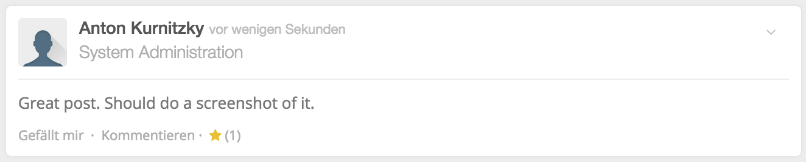

This module only work with HumHub 0.11.x

__Author:__ Anton Kurnitzky

#Installation
* Copy the module to your HumHub module folder (.../humhub/protected/modules/favorite)
* The folder name must be "favorite"
* Activate the module on the HumHub admin page. Set it as default to activate it in all spaces
* If not set to default, activate the module on each space you want to get an entry in the space navigation menu
This module allows users to mark posts as favorite.

#Usage
* Click the star icon on a wall entry to mark the post as your favorite.
* See how many other people marked a post as favorite.
* See all posts you have marked as a favorite. Click on the favorite menu to get a stream of the posts.

